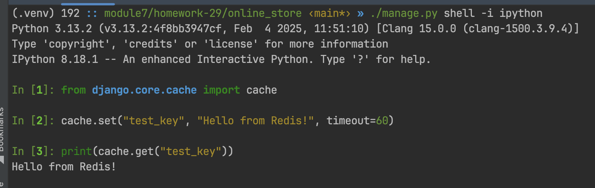
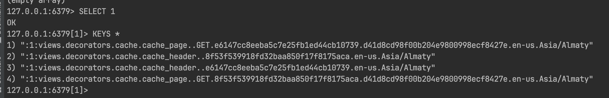
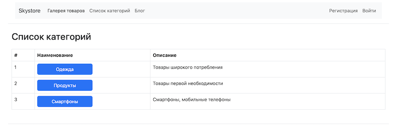
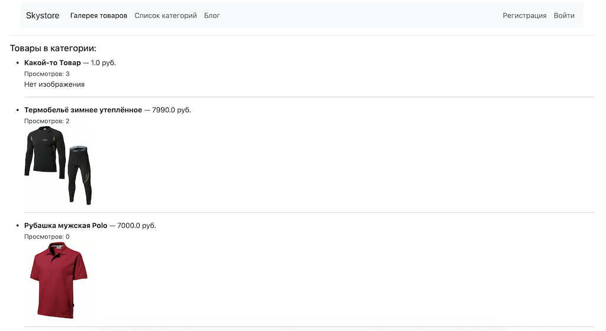

# 29 Кеширование и бизнес-логика

## 1. Брокер кеширования

В качестве брокера кеширования установлен Redis.
Кэширование настроено для станицы, которая отображает информацию об одном продукте.

## 2. Настройка кэширования для страницы просмотра товара

Проверить работу Redis можно на тестовом примере:

или на реальной странице:

## 3. Низкоуровневое кэширование
Для списка продуктов применяется низкоуровневое кэширование.

## Сервисные функции

Для отображения списка продуктов по категориям реализована сервисная функция и отдельное представление с соответствующими шаблонами.

При клике по пункту меню "Список категорий" открывается список категорий товаров:

Для перехода к списку товаров в категории необходимо кликнуть на кнопку с наименованием соответствующей категории.

Для представления списка продуктов в категории настроено логгирование. Настраивать кэширование для этого представления не вижу необходимости, т.к. список продуктов в реальном продакшне может меняться ежесекундно.